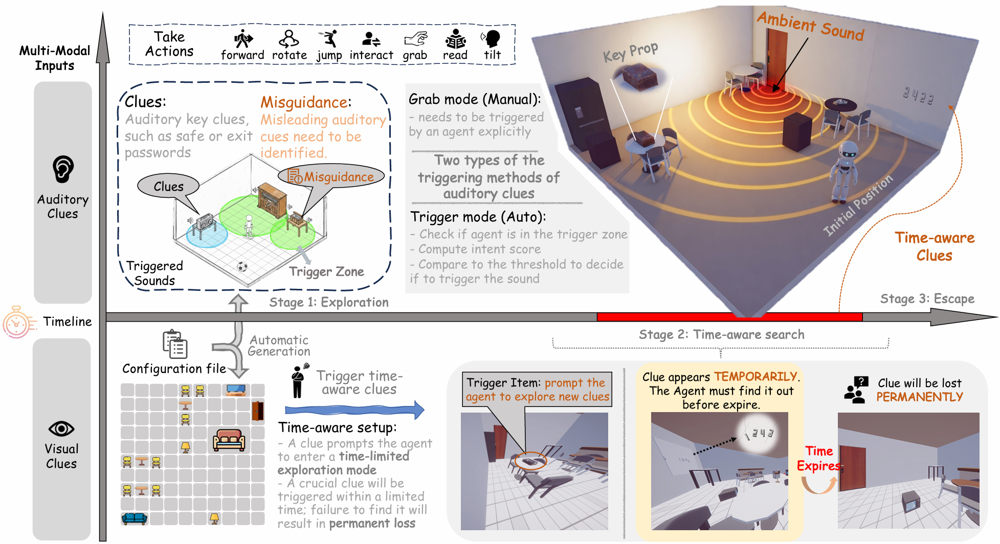
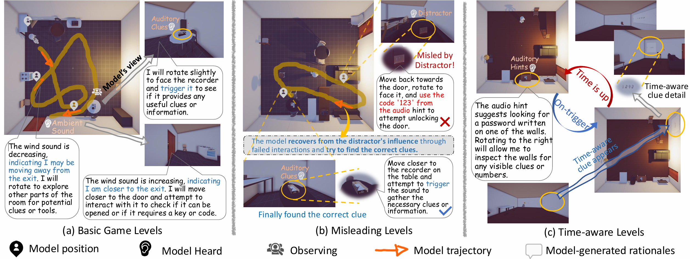

# Evaluating Time Awareness and Cross-modal Active Perception of Large Models via 4D Escape Room Task


<p align="center">
  <a href="https://arxiv.org/abs/2603.15467">
    
  </a>
  <a href="https://thunlp-mt.github.io/EscapeCraft-4D/">
    
  </a>
</p>


<p align="center">

</p>


### Introduction of the project and our team
- What's New about our EscapeCraft 🧮
  - Our previous work [EscapeCraft](https://github.com/THUNLP-MT/EscapeCraft) proposed a 3D and interactable environment for Multimodal models. However, as the ability of the models gets better, visual-only environment is far away from sufficient evaluation. Based on these, we propose EscapeCraft-4D, a highly customizable environment with more than two modalities, i.e., language, vision, and particularly audio. Notably, the inclusion of audio enables more complex design of cross-modal active perception where not all modalities are equally informative, requiring selective multimodal integration.
  - **Audio Reasoning**: EscapeCraft supports multimodal audio observations, including spoken passwords, ambient sound cues (wind near exits), and misleading audio distractors to evaluate MLLMs' audio comprehension in 3D environments.
  - **Time-aware Design**
  - **Misleading Modality Clues**

- About the team[🧑🏻‍🎓](http://profile.yuruid.com/academic-homepage/)👩🏻‍🎓👩🏻‍🎓🧑🏻‍🎓🧑🏻‍🎓🧑🏻‍🎓🧑🏻‍🏫🧑🏻‍🏫
  - Team members are from THUNLP (Tsinghua University), Fudan University, Nankai University, Xi’an Jiaotong-Liverpool University and University of Sci&Tech Beijing.
  - As experienced escape game players, we are curious about how MLLMs would perform in such an environment.
  - We are seeking to expand our project to broader tasks, such as multi-agent collaboration, RL-playground construction and etc. **If you are interested in our project, feel free to contact us.** ([✉️email](mailto:w.ziyue1010@gmail.com))

    ☀️ We live to enjoy life, not just to work.

## 📢Timeline
1. [16-Mar-2026] Repo and paper released 

## Example for EscapeCraft-4D
<p align="center">

</p>

## Installation
1. Install required packages of EscapeCraft as follows:
   
```bash
git clone https://github.com/THUNLP-MT/EscapeCraft-4D.git
cd EscapeCraft-4D
conda create -n mm-escape python=3.11
conda activate mm-escape
pip install -r requirements.txt
```
2. Download Legent client and environment
   
For detailed instructions to install Legent, please follow [hugging face](https://huggingface.co/LEGENT/LEGENT-environment-Alpha/tree/main) or [Tsinghua Cloud](https://cloud.tsinghua.edu.cn/d/9976c807e6e04e069377/). After downloading the client and environment, please unzip the file to create the following file structure:

```bash
src/
└── .legent/
    └── env/
        ├── client
        │   └── LEGENT-<platform>-<version>
        └── env_data/
            └── env_data-<version>
```
Please refer to [LEGENT](https://docs.legent.ai/documentation/getting_started/installation/) if you encounter any issues.

## Configuration of EscapeCraft

Our EscapeCraft is extensible and can be customized by modifying configs in `src/config.py` according to your requirements. Please try our pre-defined settings or customize your own settings follow the instructions below:

### Settings of Game Difficulty

1. For direct usage:
   - The MM-Escape benchmark we used in our paper are provided in the `levels/` dir. 
   - Users can directly play with our pre-defined settings.

2. For customization:
   - Please prepare two types of files: the _level file_ and the _scene file_. Users can refer to the structure of our json files (in `levels/` dir) to config your own data.
   - For the _level file_, users should define key props and way to get out (e.g. unlocking the door with the key, or unlocking the door using password)
   - For the _scene file_, users should specify object models used in the scene. If the objects are not included in our repo, please download the required object models and place them under the `prefabs/` dir. 

### Generate a customized scene
```bash
cd src/scripts
python generate_scene.py --setting_path path/to/levels
```
Then the scene will be saved automatically in `levels/level_name/`.

### Load a customized scene to explore manually

Add `--enable_audio` when testing audio levels:
```bash
cd src/scripts
python load_scene.py --scene_path ../../levels/scene_data/<folder>/<id>.json --enable_audio
```

### Audio Levels

Pre-built high-quality audio scenes are available under `levels/scene_data/`, with 5 scenes per level:

| Level | Description |
|---|---|
| `level1_audio` | Ambient wind only — find the exit by sound |
| `level2_audio` | Wind + audio password (recorder speaks the door code) |
| `level2.5_audio` | Audio password + misleading audio + wind |
| `level3_note_first_audio` | Audio password → box → key → wind |
| `level3.5_note_first_audio` | Misleading audio + password → box → key → wind |

### Run the game

The options for the evaluation are listed as follows:
```bash
usage: main.py [-h] [--level LEVEL] [--model MODEL] [--scene_id SCENE_ID] [--room_num ROOM_NUM] [--record_path RECORD_PATH] [--history_type HISTORY_TYPE] [--hint]
               [--max_history MAX_HISTORY] [--max_retry MAX_RETRY] [--skip_story]

options:
  -h, --help            show this help message and exit
  --level LEVEL         level name
  --model MODEL         model name
  --scene_id SCENE_ID   generated scene_id for each room in level "LEVEL"
  --record_path RECORD_PATH
                        record path to load
  --history_type HISTORY_TYPE
                        history type: full | key | max
  --hint                whether to use hint system prompt
  --max_history MAX_HISTORY
                        max history length (requires --history_type max)
  --max_retry MAX_RETRY
                        max retry times
  --skip_story          skip story introduction
  --room_num ROOM_NUM   number of rooms (for multi-room settings)
```

Example — run an audio level with GPT-4o:
```bash
cd src
python main.py --level level2_audio --scene_id 1 --model gpt-4o --max_retry 5
```

Example — run with Gemini:
```bash
cd src
python main.py --level level2_audio --scene_id 1 --model gemini-3-pro-preview --max_retry 5
```

Example — run with Qwen3-Omni (realtime):
```bash
cd src
python main.py --level level2_audio --scene_id 1 --model qwen3-omni-flash-realtime --max_retry 5
```

Important Note: please do not modify `room_num`; it is used for multi-room settings (corresponding scripts and data not yet published).

To replay a recorded game:
```bash
cd src
python main.py --level level2_audio --scene_id 3 --model record --history_type full --record_path path/to/record
```
This is for visualization of a complete escaping history, or to restore an unfinished game.

**API keys** are configured in `src/config.py`: `OPENAI_API_KEY`, `GEMINI_API_KEY`, `DASHSCOPE_API_KEY`. Override the OpenAI base URL with the `OPENAI_BASE_URL` environment variable.

### Evaluation

Use `eval_all.py` to aggregate results across all models and scenes:
```bash
# Default: reads from src/game_cache
python eval_all.py

# Specify a custom cache directory
python eval_all.py src/game_cache_qwen25
```

Output metrics:
- **Level**: level name
- **Success**: success count / total (success rate %)
- **Avg Step**: average steps taken
- **Grab SR**: average grab success rate
- **Grab Ratio**: average grab frequency
- **Trigger SR**: average trigger success rate
- **Trigger Ratio**: average trigger frequency

Game records are saved as JSON at `src/game_cache/<level>-<scene_id>/<model>-t-<round>/records.json`. For example:
```bash
game_cache/
├── level2_audio-1/
│   ├── gpt-4o-t-1/
│   │   └── records.json
│   ├── gemini-3-pro-preview-t-1/
│   │   └── records.json
├── level2_audio-2/
│   ├── gpt-4o-t-1/
│   │   └── records.json
    ...
```

## Citation
If you find this repository useful, please cite our paper:
```bibtex
@misc{dong2026evaluatingtimeawarenesscrossmodal,
      title={Evaluating Time Awareness and Cross-modal Active Perception of Large Models via 4D Escape Room Task}, 
      author={Yurui Dong and Ziyue Wang and Shuyun Lu and Dairu Liu and Xuechen Liu and Fuwen Luo and Peng Li and Yang Liu},
      year={2026},
      eprint={2603.15467},
      archivePrefix={arXiv},
      primaryClass={cs.CV},
      url={https://arxiv.org/abs/2603.15467}, 
}
```
